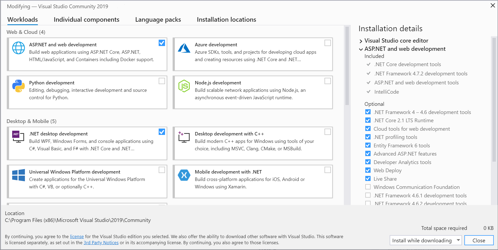

# General-Programming
---
### <a id="Title">The Beginning</a>

Welcome to my first programming language-dedicated documentation. :) 
I will be going through the setup of a proper coding environment for either your <a href="#Win">Windows</a> or <a href="#Lin">Linux</a> machine.  
I do not have any experience with Mac OS at all but as to my knowledge, it is similar to the procedure of setting it up on Windows. 
Sooo let's get started! :) 

## <a id="Win">Windows</a>
---
#### <a id="IDE">Programming Environment | IDE</a>

In advance before installing this, you will have to ideally install two things. 
Just install the as "recommended" marked versions of each:  
[.NET Framework](https://dotnet.microsoft.com/download/dotnet-framework) ("Developer Pack") & [.NET Core](https://dotnet.microsoft.com/download/dotnet-core) ("SDK X.X.XXX") 
Those two things are so called Frameworks. Frameworks for programming languages are just special sets of given pre-made methods and just all kind of things. 
.NET Framework -> To create Windows Applications 
.NET Core -> To create Crossplatform Applications 

Okay. First, you need your enviroment to program in. Your **I**ntegrated **D**evelopment **E**nvironment.  
What is so special about an IDE? It's a program to write programs. A pretty nice program. 
All you need for programming is integrated into that program for you.  
In example your code editor, a file explorer, your programming language's compiler, and so on... 

The creators of C#, Microsoft, also created a suiting IDE for it. 
Visual Studio (Community / Professional / Enterprise). 
Don't worry about the different types of that IDE. 
Community is free. You only need to login with a microsoft account within the first 30 days, after the first month of "testing" you're obligated to be logged in. But besides that it's free. 
Throughout my documentation I will be referencing to features and options within Visual Studio. 
You can get it [here](https://visualstudio.microsoft.com/downloads/).

While installing Visual Studio you will be prompted for the workloads about as shown here:  

 
 
All you need to select here is ".NET desktop development" and install that workload with Visual Studio. 
In future you can add other workload as well, but in order to learn C#, that's really all you need. 
 

When done, congratulations :) You've setup up your proper C# coding environment. 
Now you can begin with the programming language itself. 

## <a id="Lin">Linux</a>
---
#### <a id="IDE">Programming Environment | Code Editor</a>

In advance before installing this, you will have to install one thing. 
Just install the as "recommended" marked version for:  
[.NET Core](https://dotnet.microsoft.com/download/dotnet-core) ("SDK X.X.XXX") 
This thing is a so called Framework. Frameworks for programming languages are just special sets of given pre-made methods and just all kind of things. 
.NET Core -> To create Crossplatform Applications 

Unlike for Windows, Linux sadly has a limited support for C#. The IDE, Visual Studio, is unfortunately only available for Windows & Mac OS. 
Though through the on-going support for the .NET Core framework and the community, you can also program .NET Core Applications with various normal Code Editors. 
In my documentation I will be using either Visual Studio, which is unavailable for Linux, or [Visual Studio Code](https://code.visualstudio.com/), which is by the way also free, even without needing a connected microsoft account. 
It might seem similar to Visual Studio, but keep in mind. It has a reason why experienced people call Visual Studio Code "just a fancy code editor". :) 
It lacks some useful features which the IDE has. 

After installing Visual Studio Code you:  

[Under construction]
