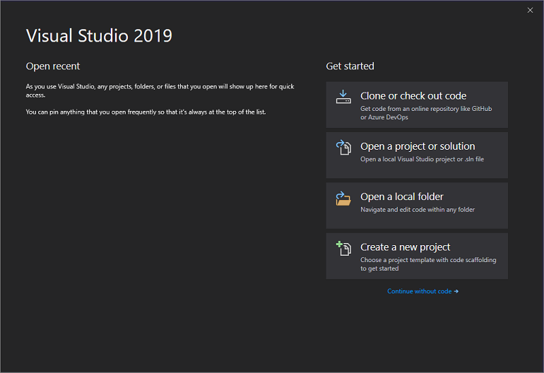
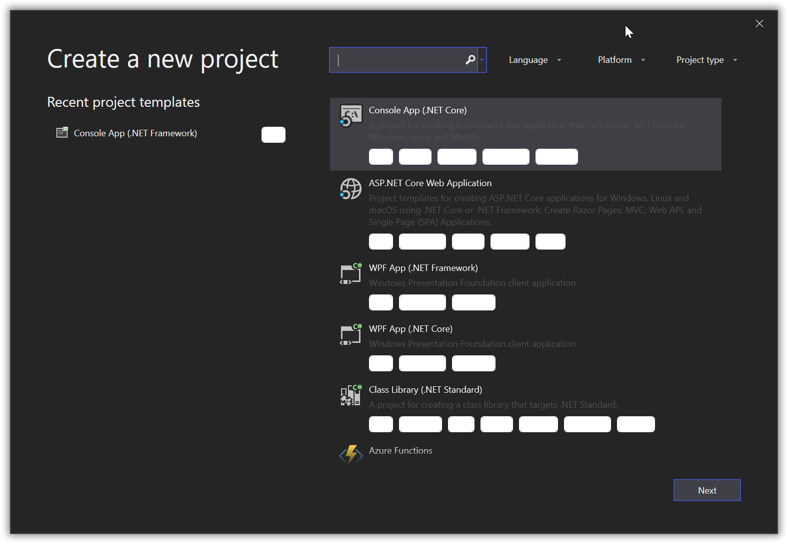

# CSharp
---
### <a id="Title">Your First Project</a>

Now we will get to creating your first project. :) 
I don't know with what intention you came here. 
But please listen to me when I tell you to learn C# with Console Applications. 
That's how it is recommended to do and you might one day see why... 
The approach is a little different depending on your OS: Windows / Mac / Linux 
Or to say it in another way, depending on your coding environment, Visual Studio Community / Visual Studio Code. 
So let's split this up a little... 

Oh, and to avoid any further confusion. When speaking of your application, it is basically the same as your project. 

## <a id="Win">Visual Studio Community</a>
---
#### <a id="IDE">Creating a console application</a>

When opening Visual Studio Community (2019) you should something like:  
  
If you would have recently-opened projects, you would see them on the left empty area. 
In order to create a project you simply have to click on "Create a new project"  
When doing so you should see something like this:  
  

